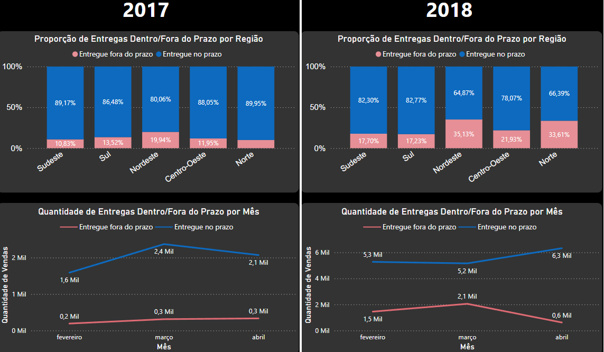

# Análise de Dados de E-commerce com Airflow, Python, PostgreSQL, e Power BI

Este projeto realiza uma análise detalhada de dados de um e-commerce da **Olist**, com foco no desempenho das entregas e na satisfação dos clientes, utilizando uma pipeline completa de ETL e visualização de dados.

---

## Objetivo do Projeto

O principal objetivo deste projeto foi identificar fatores que impactam a experiência do cliente, medindo sua satisfação por meio de scores de avaliações (review scores).

---

## Ferramentas e Tecnologias Utilizadas

- **Python**: Tratamento, extração, transformação e carregamento (ETL) dos dados.  
- **Apache Airflow**: Criação e gerenciamento da pipeline de ETL.
  - Configurado em ambiente de contêineres com **Docker**.
- **PostgreSQL**: Banco de dados para armazenar as tabelas tratadas.
- **Power BI**: Visualização de dados e criação de dashboards interativos.

---

## Pipeline de Dados

1. **ETL com Airflow e Python**:
   - Criação das tabelas no banco de dados PostgreSQL.
   - Extração dos dados.
   - Transformação dos dados para garantir consistência e normalização.
   - Carregar os dados no banco de dados.

2. **Análise de Dados com Power BI**:
   - Conexão com o banco PostgreSQL para obter os dados transformados.
   - Criação de dashboards com métricas de review score e tempos de entrega.
   - Identificação de padrões regionais e temporais.

---

## Resultados da Análise

1. Entre fevereiro e março de 2018, houve um aumento significativo nos **scores ruins (1-2 estrelas)**.
2. Foi observado que o atraso médio nas entregas aumentou substancialmente neste período, impactando negativamente a avaliação dos clientes.
3. Regiões **Norte** e **Nordeste** apresentaram os piores índices de atrasos e, consequentemente, as piores avaliações.

 
---

## Análise Prescritiva

Após identificar que o aumento nos atrasos de entrega resultou em piores avaliações, a sugestão é:

1. **Revisão Logística**:
   - Melhorar a eficiência na cadeia de entregas para as regiões afetadas.
   - Parcerias com transportadoras regionais para reduzir os prazos de entrega.

2. **Monitoramento de KPI's**:
   - Implementar métricas de desempenho logístico como tempo médio de entrega por região.
   - Criar um painel de acompanhamento em tempo real com o Airflow para monitorar possíveis atrasos.

3. **Comunicação com o Cliente**:
   - Notificar clientes sobre atrasos previamente.
   - Oferecer incentivos (ex.: cupons de desconto) em casos de atraso.

---

## Como Executar o Projeto

### Pré-requisitos
- Docker
- Python 3.8+
- Power BI Desktop
- PostgreSQL (instalado ou em contêiner)

---

### Passos

#### 1. Clone este repositório
   - git clone https://github.com/TiagoRdr/olist-database.git

2. Instale e configure o Docker
    - Instale o Docker:
        [Siga o Guia de instalação do Docker para o seu sistema operacional.](https://www.docker.com/products/docker-desktop/)
        Certifique-se de instalar também o Docker Compose, incluído nas versões mais recentes do Docker.

    - Verifique a instalação: Após instalar, execute os comandos abaixo para confirmar que o Docker está funcionando corretamente:

    docker --version
    -docker-compose --version

3. Configure e inicie os contêineres
    - Suba os contêineres necessários com Docker Compose: docker-compose up -d
    - Verifique se os contêineres estão em execução: docker ps

4. Configure o Apache Airflow
    - Acesse a interface do Airflow:
        Abra o navegador e acesse: http://localhost:8080.
    - Realize o login:
        Usuário padrão: airflow
        Senha padrão: airflow
    - Ative o DAG do projeto:
        Na interface do Airflow, localize o DAG relacionado ao projeto.
        Clique no botão para ativar o DAG.
        Inicie o processo de execução clicando no botão de "trigger" manual.

5. Conecte o Power BI ao PostgreSQL
    - Abra o Power BI Desktop.
    - Vá até Obter Dados > Banco de Dados PostgreSQL.
    - Insira as credenciais de conexão:
        Servidor: localhost
        Banco de Dados: Nome do banco configurado no Airflow.
        Usuário: postgres
        Senha: senha (definida no arquivo docker-compose.yml).
    - Carregue as tabelas de interesse para análise.

   Autor: Tiago Rodrigues
