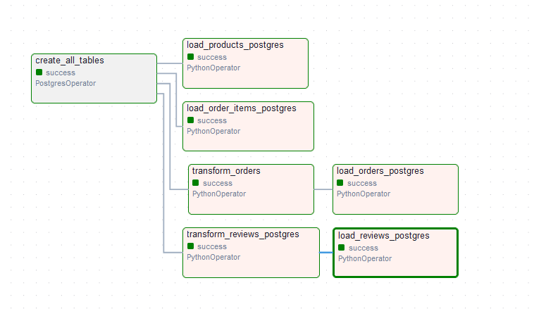
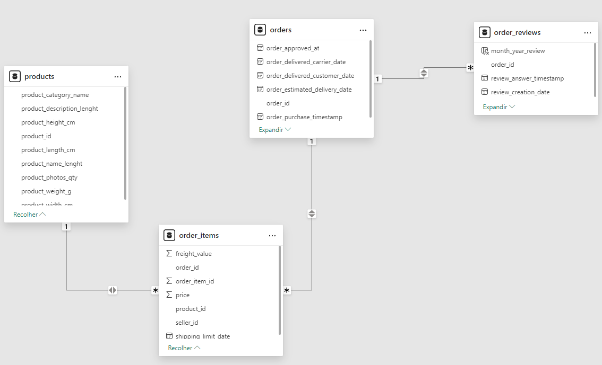
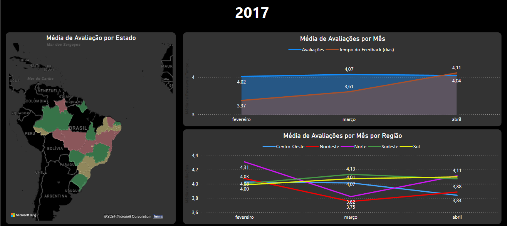
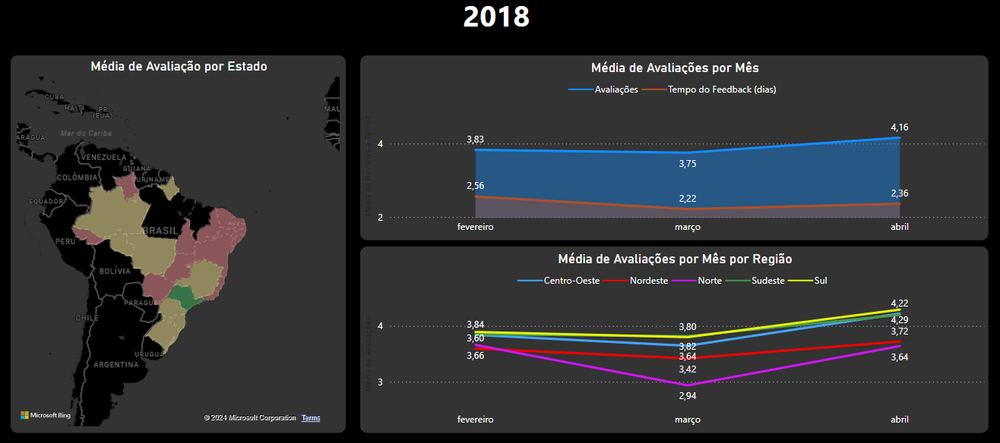

# Análise de Dados de E-commerce com Airflow, Python, PostgreSQL, e Power BI

Este projeto realiza uma análise detalhada de dados de um e-commerce da **Olist**, com foco no desempenho das entregas e na satisfação dos clientes, utilizando uma pipeline completa de ETL e visualização de dados.

---

## Objetivo do Projeto

O principal objetivo deste projeto foi identificar fatores que impactam a experiência do cliente, medindo sua satisfação por meio de scores de avaliações (review scores).

---

## Ferramentas e Tecnologias Utilizadas

- **Python**: Tratamento, extração, transformação e carregamento (ETL) dos dados.  
- **Apache Airflow**: Criação e gerenciamento da pipeline de ETL.
  - Configurado em ambiente de contêineres com **Docker**.
- **PostgreSQL**: Banco de dados para armazenar as tabelas tratadas.
- **Power BI**: Visualização de dados e criação de dashboards interativos.

---

## Pipeline de Dados

1. **ETL com Airflow e Python**:
   - Criação das tabelas no banco de dados PostgreSQL.
   - Extração dos dados.
   - Transformação dos dados para garantir consistência e normalização.
   - Carregar os dados no banco de dados.

2. **Análise de Dados com Power BI**:
   - Conexão com o banco PostgreSQL para obter os dados transformados.
   - Criação de dashboards com métricas de review score e tempos de entrega.
   - Identificação de padrões regionais e temporais.

---

## Resultados da Análise

1. Entre fevereiro e março de 2018, houve um aumento significativo nos **scores ruins (1-2 estrelas)**.
2. Foi observado que o atraso médio nas entregas aumentou substancialmente neste período, impactando negativamente a avaliação dos clientes.
3. Regiões **Norte** e **Nordeste** apresentaram os piores índices de atrasos e, consequentemente, as piores avaliações.

### Análise 1: Comparativo da proporção de entregas no período de 2017 e 2018. Em 2018, houve um grande aumento de entregas sendo realizadas fora do prazo nas regiões Norte e Nordeste.

---

### Análise 2: Visão geral mostrando a média de avaliações por estado do Brasil realizando uma comparação entre os anos de 2017 e 2018, sendo categorizado em: Avaliações Ruins (Vermelho), Avaliações Regulares (Amarelo) e Avaliações Boas (Verde). Também é possivel verificar que houve uma diminuição na média nacional de avaliações e que Norte e Nordeste foram as mais afetadas.

---

 

---

## Análise Descritiva

1. **Distribuição das Avaliações**:
   - A média geral das avaliações dos clientes variou entre **2017** e **2018**, com destaque para uma queda significativa no **review scores** de **avaliações boas** nas regiões Norte e Nordeste.
   
2. **Padrões de Entregas**:
   - A análise das entregas no período de 2017 e 2018 mostrou um aumento considerável nas entregas **fora do prazo**, especialmente nas regiões Norte e Nordeste.

---

## Análise Diagnóstica

1. **Índices de Atraso e Satisfação**:
   - Observou-se uma correlação direta entre **atrasos de entrega** e **avaliações ruins**. Quanto maiores os atrasos, menores as avaliações dos clientes.

2. **Fatores Regionais**:
   - As regiões com **maiores índices de atrasos** também apresentaram os **piores índices de satisfação**. A falta de otimização nas rotas de entrega pode ter contribuído significativamente para esse padrão.

---

## Análise Prescritiva

1. **Revisão e Melhoria Logística**:
   - Podemos sugerir a incluisão da revisão dos processos logísticos nas regiões afetadas. Parcerias com transportadoras locais poderiam otimizar os tempos de entrega.
   
2. **Implementação de Monitoramento de KPIs**:
   - Criação de um painel de monitoramento em tempo real dos KPIs logísticos, como tempo médio de entrega por região, para detectar e corrigir problemas antes que impactem os clientes.

3. **Estratégias de Comunicação com o Cliente**:
   - Estabelecer uma comunicação proativa com os clientes, informando sobre possíveis atrasos e oferecendo incentivos, como cupons de desconto, para diminuir os impactos negativos.

---

## Como Executar o Projeto

### Pré-requisitos
- Docker
- Python 3.8+
- Power BI Desktop
- PostgreSQL (instalado ou em contêiner)

---

### Passos

#### 1. Clone este repositório
   - git clone https://github.com/TiagoRdr/olist-database.git

2. Instale e configure o Docker
    - Instale o Docker:
        [Siga o Guia de instalação do Docker para o seu sistema operacional.](https://www.docker.com/products/docker-desktop/)
        Certifique-se de instalar também o Docker Compose, incluído nas versões mais recentes do Docker.

    - Verifique a instalação: Após instalar, execute os comandos abaixo para confirmar que o Docker está funcionando corretamente:

    docker --version
    -docker-compose --version

3. Configure e inicie os contêineres
    - Suba os contêineres necessários com Docker Compose: docker-compose up -d
    - Verifique se os contêineres estão em execução: docker ps

4. Configure o Apache Airflow
    - Acesse a interface do Airflow:
        Abra o navegador e acesse: http://localhost:8080.
    - Realize o login:
        Usuário padrão: airflow
        Senha padrão: airflow
    - Ative o DAG do projeto:
        Na interface do Airflow, localize o DAG relacionado ao projeto.
        Clique no botão para ativar o DAG.
        Inicie o processo de execução clicando no botão de "trigger" manual.

5. Conecte o Power BI ao PostgreSQL
    - Abra o Power BI Desktop.
    - Vá até Obter Dados > Banco de Dados PostgreSQL.
    - Insira as credenciais de conexão:
        Servidor: localhost
        Banco de Dados: Nome do banco configurado no Airflow.
        Usuário: postgres
        Senha: senha (definida no arquivo docker-compose.yml).
    - Carregue as tabelas de interesse para análise.

   Autor: Tiago Rodrigues
